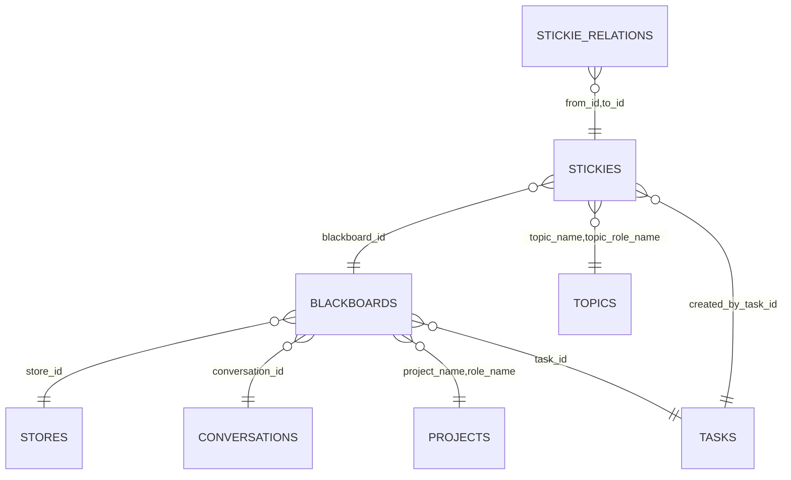

# Blackboard Architecture and Relationships

This document summarizes how blackboards, stores, and stickies relate to each other and to adjacent entities like tasks, projects, and conversations, based on the current codebase.

## Overview

- A Store is a logical container/namespace for blackboards.
- A Blackboard belongs to a Store and a Role; it may be associated with a specific Conversation, Project, or Task.
- Stickies belong to a Blackboard and can optionally be tied to a Topic and/or the Task that created them.
- Stickie relations provide typed edges between stickies (e.g., INCLUDES, USES).

## Diagram

## Core Schemas and Types

- Blackboards (`internal/dao/postgres/blackboards.go` → table `blackboards`)

  - Fields: `id`, `store_id`, `role_name`, `conversation_id?`, `project_name?`, `task_id?`, `background?`, `guidelines?`, `created`, `updated`.
  - FKs/refs:
    - `store_id → stores.id`
    - `conversation_id → conversations.id`
    - `project_name,role_name → projects.name,projects.role_name`
    - `task_id → tasks.id`

- Stickies (`internal/dao/postgres/stickies.go` → table `stickies`)

  - Fields: `id`, `blackboard_id`, `topic_name?`, `topic_role_name?`, `note?`, `labels[]`, `created`, `updated`, `created_by_task_id?`, `edit_count`, `priority_level?`, `score?`, `complex_name{name,variant}`, `archived`.
  - FKs/refs:
    - `blackboard_id → blackboards.id`
    - `topic_name,topic_role_name → topics.name,topics.role_name`
    - `created_by_task_id → tasks.id`

- Stickie relations (`internal/dao/postgres/graph.go` → table `stickie_relations`)

  - Fields: `from_id`, `to_id`, `rel_type`, `labels[]`.
  - FKs/refs:
    - `from_id,to_id → stickies.id`
  - Normalized relation types: `INCLUDES`, `CAUSES`, `USES`, `REPRESENTS`, `CONTRASTS_WITH`.

- Stores (`internal/dao/postgres/stores.go` → table `stores`)

  - Blackboard’s `store_id` references this table; stores are partitioned by role.

- Projects (`internal/dao/postgres/projects.go` → table `projects`)

  - A blackboard can be linked to a project via `(project_name, role_name)`.

- Conversations (`internal/dao/postgres/conversations.go` → table `conversations`)
  - A blackboard can be anchored to a conversation via `conversation_id`.

## Relationships (as implemented)

- Blackboards

  - `blackboards.store_id → stores.id` (required)
  - `blackboards.conversation_id → conversations.id` (optional)
  - `blackboards.project_name,role_name → projects.name,role_name` (optional)
  - `blackboards.task_id → tasks.id` (optional)

- Stickies

  - `stickies.blackboard_id → blackboards.id`
  - `stickies.created_by_task_id → tasks.id` (optional)
  - `stickies.topic_name,topic_role_name → topics.name,role_name` (optional)

- Stickie edges
  - `stickie_relations.from_id,to_id → stickies.id` (typed edges; SQL mirror of graph)

## Typical Flows

- Create a board for a project

  - Create `store` then `blackboard` referencing the `store_id` and `(project_name, role_name)`.
  - Add `stickies` to capture ideas, tasks, or notes; optionally set `topic_*` fields.

- Create a board for a conversation

  - Create `blackboard` with `conversation_id` to bind it to a specific dialog context.
  - `stickies` can reference `created_by_task_id` to attribute items to tasks/agents.

- Link stickies (map relationships)
  - Use `stickie_relations` to connect items: e.g., a design stickie `INCLUDES` sub‑tasks, or a bug stickie `CAUSES` a failure.

## Data Ownership and Roles

- All entities are partitioned or scoped by `role_name` either directly (blackboards) or via referenced entities (projects, topics, tasks).
- This keeps boards and stickies aligned with the intended audience/agent role.

## Key Files and Functions

- `internal/dao/postgres/blackboards.go`: `Blackboard`, `UpsertBlackboard`, `GetBlackboardByID`, `ListBlackboards`, `DeleteBlackboard`.
- `internal/dao/postgres/stickies.go`: `Stickie`, `UpsertStickie`, `GetStickieByID`, `ListStickies`, `DeleteStickie`, `GetStickieByComplexName*`.
- `internal/dao/postgres/graph.go`: `CreateStickieEdge`, `ListStickieEdges`, `GetStickieEdge`, `DeleteStickieEdge`.
- `cmd/admin/db/show.go`: relationships table documents FKs and SQL‑graph edges.

## Notes

- Graph features are implemented via SQL mirror tables (`stickie_relations`) and normalized relation type handling.
- `complex_name {name, variant}` on stickies enables stable addressing/lookup beyond UUIDs.
- Boards can be used as shared canvases across project or conversation contexts; tasks can both create boards and annotate them via stickies.
