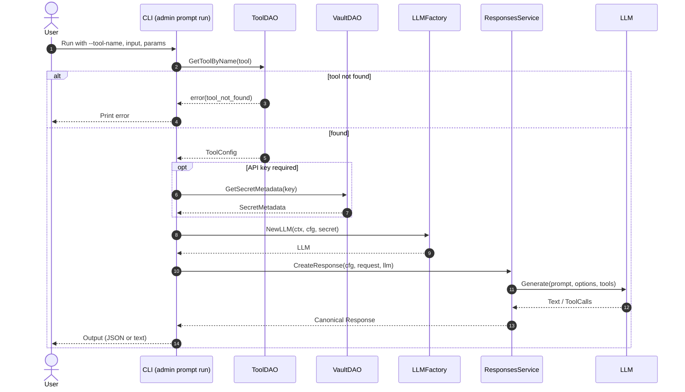
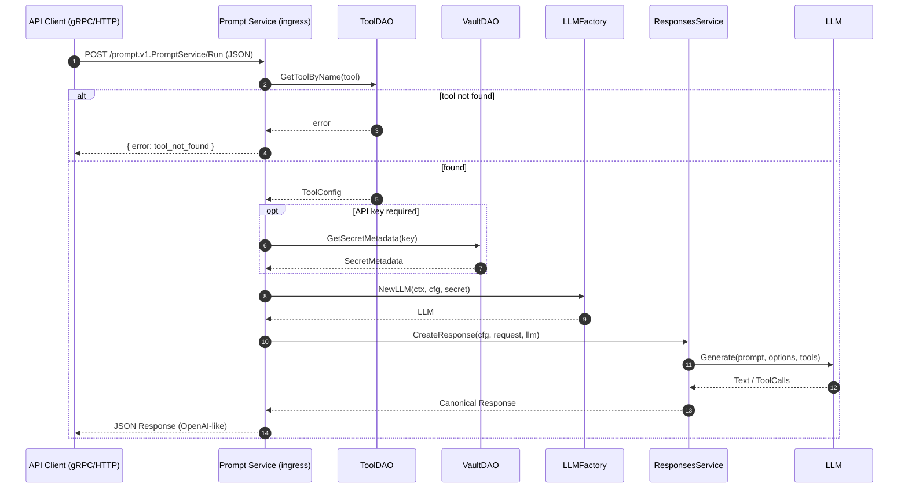

# Prompt Sequence Flow

This document describes, concisely, how a prompt travels through the system from the moment a user runs the CLI (`rbc admin prompt run`) or invokes the gRPC/HTTP API, to when the Large Language Model (LLM) returns a response.

## Key Components

- `ToolDAO` (read): Retrieves tool configuration (provider, model, base URL, API key ref, defaults, settings).
  - Prod adapter: Postgres-backed (`PGToolDAOAdapter`).
  - Test adapter: In-memory mocks.
- `VaultDAO` (read): Resolves API key secrets when needed (e.g., `rbctest-key`).
  - Prod adapter: stub (can be replaced with a real backend).
- `LLMFactory`: Provider-agnostic creator of langchaingo LLM instances.
  - Supported providers: `openai`, `gemini`, `ollama`.
- `ResponsesService`: Core orchestration for request → LLM call → normalized output.
  - Determines final model, merges defaults, normalizes input and tools, calls LLM (non-streaming), normalizes provider outputs, and returns canonical OpenAI-like `response` object.

## Data Model (canonical response)

```
{
  "id": "...",
  "object": "response",
  "model": "<string>",
  "created": <unix_seconds>,
  "output": [ { "type": "output_text", "text": "..." }, ... ],
  "usage": { "input_tokens": 0, "output_tokens": 0, "total_tokens": 0 }
}
```

## CLI Flow: `rbc admin prompt run`

High-level sequence:

1. Parse flags
   - `--tool-name` (required)
   - Input: `--input` or `--input-file` (one required)
   - Optional params: `--tools` (JSON file), `--temperature`, `--max-output-tokens`, `--json` output.
2. Load input
   - Inline string or file contents.
   - If `--tools`, read JSON into `[]ToolDefinition` (OpenAI-style function schema).
3. Resolve tool configuration
   - Open Postgres pool via app config if available, then `ToolDAO.GetToolByName(toolName)`.
   - If not found → return OpenAI-style error (CLI prints error and exits non-zero).
4. Resolve secret (optional)
   - If `cfg.APIKeySecret` set → `VaultDAO.GetSecretMetadata(cfg.APIKeySecret)`.
5. Build LLM instance (DI-friendly)
   - `LLMFactory.NewLLM(ctx, cfg, secret)` selects provider and applies options:
     - OpenAI (model, base URL, token)
     - Gemini (API key, model, optional project/location)
     - Ollama (server URL, model)
6. Build request for `ResponsesService`
   - `ResponseRequest{ model, input, tools, temperature, max_output_tokens }`
   - Request flags override tool defaults when provided.
7. Create response
   - `ResponsesService.CreateResponse(ctx, cfg, req, llm)`:
     - Determine final model: `req.model` or `cfg.Model`.
     - Normalize input: string or array-of-blocks into a prompt.
     - Merge params: temperature, max tokens, top-p.
     - Map tools to langchaingo function definitions (if provider supports).
     - Invoke non-streaming LLM call via langchaingo.
     - Normalize outputs into canonical `output` blocks and `usage`.
     - Generate ULID `id` and `created` timestamp.
8. Print output
   - If `--json`: pretty-print full response JSON.
   - Else: print text blocks and tool-call blocks in a readable format.

Error handling (CLI):

- Tool not found → prints OpenAI-style `{ error: { type, message, code } }` or concise error.
- Secret resolve or LLM init failure → concise error with context.
- Responses service failures → concise error with context.

## gRPC (JSON) Flow: Prompt

Endpoint name: `prompt.v1.PromptService/Run`.

Ingress variants:

- gRPC server with JSON codec (application/grpc+json) for unary calls.
- Connect JSON HTTP endpoint: `POST /prompt.v1.PromptService/Run` (application/connect+json).

Sequence (shared with CLI after ingress):

1. Decode request into `ResponseRequest` (proto-JSON for Connect or JSON for gRPC codec).
2. `ToolDAO.GetToolByName(tool)`
   - 404 → `{ error: { type: "invalid_request_error", code: "tool_not_found" } }` (OpenAI-style) or Connect error envelope.
3. Optional secret via `VaultDAO.GetSecretMetadata`.
4. `LLMFactory.NewLLM(ctx, toolCfg, secret)`.
5. `ResponsesService.CreateResponse(...)` → normalized, canonical response.
6. Encode JSON response (OpenAI Responses format) and return.

Content types:

- gRPC JSON: `application/grpc+json` (framed) – used by gRPC server with custom JSON codec.
- Connect JSON: `application/connect+json` – used by simple HTTP handler for easy testing.

## Health & Readiness

- `/health` → `{"status":"ok"}` for readiness polling in tests and scripts.
- Tests wait for `/health` instead of sleeping to avoid race conditions.

## Normalization & Tools

- Request tools (OpenAI schema) → langchaingo function definitions (if supported by backend).
- Provider outputs are normalized into:
  - `output_text` blocks
  - `tool_call` blocks (when tool calls are returned)

## Error Surfaces

- CLI: human-readable errors; `--json` prints full response JSON when successful.
- HTTP/Connect: JSON error envelope with Connect headers.
- gRPC JSON: JSON error on non-zero `grpc-status` (trailers) or decoding failure.

## Extensibility

- Providers: add new provider in `LLMFactory` with minimal changes.
- Ingress: extend gRPC/HTTP routing without changing core service.
- DAO/Vault: swap adapters (mocks, Postgres, real vault) via DI.
- Tests: end-to-end via ZX; optional Connect JSON checks; gRPC JSON low-level client available.

## Sequence Diagrams (Mermaid)

### CLI Path (`rbc admin prompt run`)



### gRPC / HTTP Path (PromptService/Run)


