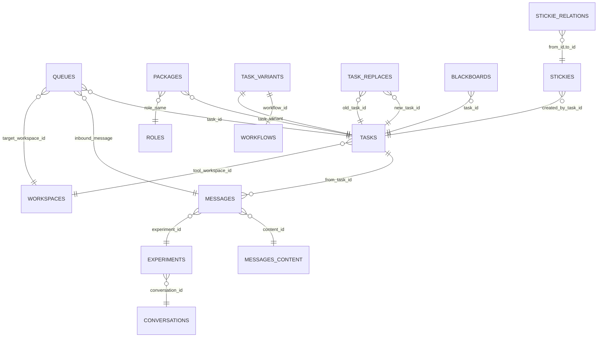

# Task Architecture and Relationships

This document summarizes how the `tasks` entity relates to other parts of the system based on the current codebase. It is grounded in the Go DAOs and CLI commands under `internal/` and `cmd/`, and the schema/relationships reported by `rbc db show`.

## Overview

- A Task is an addressable unit of work identified by its `variant` (e.g., `command/subselector`) and associated metadata (title, description, tags, etc.).
- Variants are owned by a `workflow` via a registry (`task_variants`) to ensure a single workflow claims a given selector.
- Task versions evolve through explicit replacement edges (`task_replaces`) with a `level` of `patch|minor|major` to enable queries like “latest” or “next(minor)”.
- Tasks can originate or be associated with messages, feed queues, interact with workspaces/tools, appear on blackboards/stickies, and be selected for a role via packages.

## Diagram

## Core Schemas and Types

Relevant DAO structs and tables (abbreviated to task-related fields):

- Tasks (`internal/dao/postgres/tasks.go` → table `tasks`)
  - Key fields: `id`, `command`, `variant`, `role_name`, `title`, `description`, `motivation`, `notes`, `shell`, `timeout`, `tool_workspace_id`, `tags`, `level`, `archived`, `created`.
  - Variant ownership: `task_variants(variant, workflow_id)` binds a variant string to a workflow.

- Task replacement graph (SQL mirror) (`internal/dao/postgres/graph.go` → table `task_replaces`)
  - Edge: `new_task_id`, `old_task_id`, `level` (`patch|minor|major`), `comment`, `created`.
  - Queries: `FindLatestTaskIDByVariant`, `FindNextByLevel`, `FindLatestFrom` traverse/inspect replacements.

- Messages (`internal/dao/postgres/events.go` → table `messages`)
  - Key fields: `id`, `content_id`, `from_task_id`, `experiment_id`, `role_name`, `status`, `error_message`, `tags`, `created`.
  - Message bodies are deduplicated in `messages_content` (OpenSearch index) referenced by `content_id`.

- Queues (`internal/dao/postgres/queues.go` → table `queues`)
  - Key fields: `id`, `description`, `inQueueSince`, `status`, `why`, `tags`, `task_id`, `inbound_message`, `target_workspace_id`.

- Packages (`internal/dao/postgres/packages.go` → table `packages`)
  - Binds a `role_name` to a specific `task_id` (thereby the chosen `variant`/version).

- Workspaces (`tasks.tool_workspace_id`, `queues.target_workspace_id`)
  - Connect tasks and queued work with a specific workspace/tooling context.

- Conversations, experiments, blackboards, stickies (via `cmd/admin/db/show.go` relationships)
  - `experiments.conversation_id → conversations.id`
  - `blackboards.task_id → tasks.id`
  - `stickies.created_by_task_id → tasks.id`
  - `stickie_relations` maintain typed edges between stickies.

## Relationships (as implemented)

Relational FKs and graph edges involving `tasks` (source: DAOs and `cmd/admin/db/show.go`):

- Messages ↔ Tasks
  - `messages.from_task_id → tasks.id` (a message may be produced by a task)
  - `messages.content_id → messages_content.id` (message body in OpenSearch)
  - `messages.experiment_id → experiments.id`; `experiments.conversation_id → conversations.id`

- Queues ↔ Tasks ↔ Messages
  - `queues.task_id → tasks.id` (the task to execute/process)
  - `queues.inbound_message → messages.id` (triggering or associated message)
  - `queues.target_workspace_id → workspaces.id`

- Packages ↔ Tasks
  - `packages.task_id → tasks.id` (the task version pinned/starred for a role)
  - `packages.role_name → roles.name`

- Tasks ↔ Workflows
  - `task_variants(variant) → workflows.id` (ownership binding; joined in DAO methods)

- Tasks ↔ Workspaces
  - `tasks.tool_workspace_id → workspaces.id` (preferred/tooling workspace for the task)

- Blackboards/Stickies ↔ Tasks
  - `blackboards.task_id → tasks.id`
  - `stickies.created_by_task_id → tasks.id`
  - `stickie_relations.from_id,to_id → stickies.id` (typed edges: INCLUDES, CAUSES, USES, REPRESENTS, CONTRASTS_WITH)

- Task Versioning (Graph-in-SQL)
  - `task_replaces.new_task_id,old_task_id → tasks.id` with `level` of change.
  - Enables queries:
    - Latest by variant: `FindLatestTaskIDByVariant(variant)`.
    - Next by level from a given task: `FindNextByLevel(current, level)`.
    - Latest reachable (transitive): `FindLatestFrom(current)`.

## Task Lifecycle and Invariants

- Upsert
  - `UpsertTask` normalizes `variant`/`command`, registers `task_variants(variant, workflow_id)` and inserts/updates `tasks`.
  - On conflict by `variant`, mutable fields are updated (title, description, motivation, notes, shell, timeout, tool_workspace_id, tags, level, role_name, archived).

- Ownership
  - A `variant` has a single owning `workflow_id` (checked on upsert). Attempts to rebind are rejected.

- Deletion
  - `DeleteTaskByID` / `DeleteTaskByKey` remove rows from `tasks`.

- Versioning
  - `CreateTaskReplacesEdge(new, old, level, comment, created)` records the replacement edge.
  - Levels restricted to `patch`, `minor`, or `major` (default `minor` if unspecified).

## Typical Flows

- Task emits a Message
  - A task runs and produces output; a `messages` row is inserted with `from_task_id` referencing the task and `content_id` pointing to `messages_content` (OpenSearch).

- Message drives a Queue item for a Task
  - An inbound `message` can create a `queues` row with `inbound_message` set; `task_id` selects which task should handle it; `target_workspace_id` provides execution context.

- Role selects a Task version
  - A role “stars” or pins a concrete task version via a `packages` row (`role_name`, `task_id`).

- Navigating Task versions
  - Use `task latest --variant <v>` to find the most recent unreplaced task for a variant.
  - Use `task next --id <id> --level patch|minor|major` to follow a specific replacement edge.

## Key Files and Functions

- `internal/dao/postgres/tasks.go`: `Task`, `UpsertTask`, `GetTaskByID`, `GetTaskByVariant`, `ListTasks*`, `DeleteTask*`.
- `internal/dao/postgres/graph.go`: `CreateTaskReplacesEdge`, `FindLatestTaskIDByVariant`, `FindNextByLevel`, `FindLatestFrom`.
- `internal/dao/postgres/events.go`: `MessageEvent`, CRUD and listing with `from_task_id` linkage.
- `internal/dao/postgres/queues.go`: `Queue`, `AddQueue`, `TakeQueue`, `PeekQueues` linking tasks/messages/workspaces.
- `internal/dao/postgres/packages.go`: `Package`, `UpsertPackage`, `GetPackage*`, `ListPackages` linking roles to tasks.
- `cmd/admin/db/show.go`: authoritative relationships table (FKs and graph-in-SQL edges).

## Notes

- Message content is stored in OpenSearch (`messages_content`) with deduplication; `messages.content_id` holds the index document id.
- Graph features have been migrated to SQL tables (`task_replaces`, `stickie_relations`); AGE/graph writes are treated as optional/no-op in this deployment.
