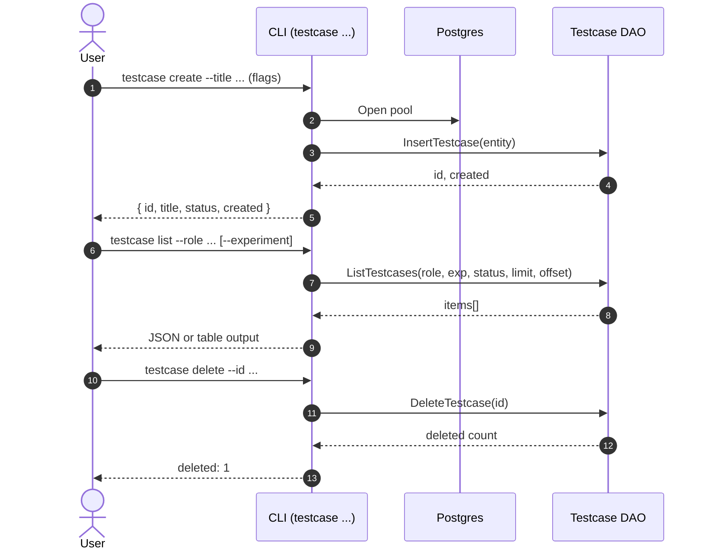
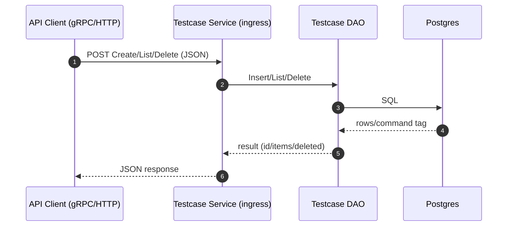

# Testcase Sequence Flow

This document outlines how testcase operations flow through the system for both the CLI and the gRPC/HTTP ingress, from invocation to persistence.

## Key Components

- Postgres DAO (read/write): `internal/dao/postgres/testcases.go`
  - `InsertTestcase`, `ListTestcases`, `DeleteTestcase`
  - Table: `testcases(id UUID PK, name, package, classname, title, experiment_id, role_name, status, error_message, tags, level, created, file, line, execution_time)`
- CLI subcommands: `cmd/admin/testcase`
  - `create`, `list`, `delete`
- gRPC JSON service: `internal/server/testcase/grpc.go`
  - Service: `testcase.v1.TestcaseService` with `Create`, `List`, `Delete`
  - Uses application/grpc+json via custom JSON codec
- Connect JSON handlers: `internal/server/testcase/connect_http.go`
  - Endpoints: `POST /testcase.v1.TestcaseService/{Create|List|Delete}` (application/connect+json)
- Server mux: `internal/server/server.go`
  - h2c HTTP2 server multiplexes gRPC and Connect JSON, plus `/health`

## Canonical Shapes

- Create response (JSON):
```
{ "id": "<uuid>", "title": "...", "status": "OK|KO", "created": "<rfc3339>" }
```

- List response (JSON):
```
{
  "items": [
    {
      "id": "<uuid>", "title": "...", "status": "...",
      "created": "<rfc3339>",
      "name": "...", "package": "...", "classname": "...",
      "experiment_id": "<uuid>", "tags": { ... },
      "file": "...", "line": 0, "execution_time": 0.0
    }, ...
  ]
}
```

- Delete response (JSON):
```
{ "deleted": 1 }
```

## CLI Flows

### Create: `rbc testcase create`

1. Parse flags: `--title` (required), `--role`, `--experiment`, `--status`, plus optional metadata.
2. Load config and open Postgres pool.
3. Build DAO entity and call `InsertTestcase`.
4. Print JSON with `id`, `title`, `status`, and `created`.

### List: `rbc testcase list`

1. Parse flags: `--role` (required), `--experiment`, `--status`, `--limit`, `--offset`, `--output`.
2. Load config and open Postgres pool.
3. Call `ListTestcases` and print as JSON (`--output json`) or table.

### Delete: `rbc testcase delete`

1. Parse flags: `--id` (required), `--force`, `--ignore-missing`.
2. Load config and open Postgres pool.
3. Call `DeleteTestcase` and print deleted count or friendly message.

## gRPC / HTTP Flows

Two ingress options feed the same DAO logic:

- gRPC JSON: application/grpc+json; `testcase.v1.TestcaseService` with methods `Create`, `List`, `Delete`.
- Connect JSON: application/connect+json; HTTP handlers on `/testcase.v1.TestcaseService/{Create|List|Delete}` return JSON envelopes.

### Error Surfaces

- gRPC JSON: non-zero `grpc-status` trailer or JSON decode error → propagated to client as an error.
- Connect JSON: response is `{ "error": { "code", "message" } }` with `Connect-Protocol-Version` header.

## Health & Readiness

- `/health` returns `{ "status": "ok" }` for readiness polling before endpoint tests.

## Mermaid Sequence Diagrams

### CLI Create/List/Delete



### gRPC/HTTP Create/List/Delete



## Notes

- The Connect JSON HTTP endpoints are intended for simple automation and tests; the gRPC JSON service is available for environments expecting gRPC semantics.
- All paths converge into the Postgres DAO; invariants (e.g., required fields) are enforced by CLI or ingress before the DAO calls.
